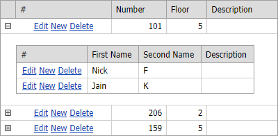

<!-- default badges list -->

[](https://supportcenter.devexpress.com/ticket/details/E4271)
[](https://docs.devexpress.com/GeneralInformation/403183)
<!-- default badges end -->

# GridView for MVC - How to implement the master-detail GridView with editing capabilities
<!-- run online -->
**[[Run Online]](https://codecentral.devexpress.com/e4271/)**
<!-- run online end -->


This example illustrates how to implement the master-detail GridView with editing capabilities. 



Follow the steps below to define the master-detail layout:

1. Define master and detail GridView settings in separate PartialView files.

    GridViewMasterPartial.cshtml
    ```cshtml
    @Html.DevExpress().GridView(
        settings => {
            settings.Name = "masterGrid";
            // ...
        }).Bind(Model).GetHtml()
    ```
    GridViewDetailPartial.cshtml
    ```cshtml
    
    @Html.DevExpress().GridView(
        settings => {
            settings.Name = "detailGridView_" + ViewData["RoomID"];
            // ...
    }).Bind(Model).GetHtml()
    ```
2. Set the master grid's [SettingsDetail.ShowDetailRow](https://docs.devexpress.com/AspNetMvc/DevExpress.Web.Mvc.MVCxGridViewDetailSettings._members) property to `true`.

    ```cshtml
    settings.SettingsDetail.ShowDetailRow = true;
    ```
3. Call the master grid's [SetDetailRowTemplateContent](https://docs.devexpress.com/AspNetMvc/DevExpress.Web.Mvc.GridViewSettings.SetDetailRowTemplateContent.overloads) method to render the detail grid's PartialView in the [Detail Row](https://docs.devexpress.com/AspNetMvc/16880/components/grid-view/visual-elements/detail-row).

    ```cshtml
    settings.SetDetailRowTemplateContent(c => {
        Html.RenderAction("GridViewDetailPartial", new { RoomID = DataBinder.Eval(c.DataItem, "ID") });
    });
    ```

Note that route values passed in a detail grid's callback must have a unique name and must not replicate any other names on a page.

## Files to Look At
- [Index.cshtml](./CS/DevExpress.Razor/Views/Home/Index.cshtml)
- [GridViewMasterPartial.cshtml](./CS/DevExpress.Razor/Views/Home/GridViewMasterPartial.cshtml)
- [GridViewDetailPartial.cshtml](./CS/DevExpress.Razor/Views/Home/GridViewDetailPartial.cshtml)

## Documentation
- [Callback-Based Functionality](https://docs.devexpress.com/AspNetMvc/9052/common-features/callback-based-functionality)

## More Examples

- [GridView - Advanced Master-Detail View](https://github.com/DevExpress-Examples/gridview-advanced-master-detail-view-t203289)
- [A simple example of master-detail grids with editing capabilities](https://github.com/DevExpress-Examples/a-simple-example-of-master-detail-grids-with-editing-capabilities-e248)
